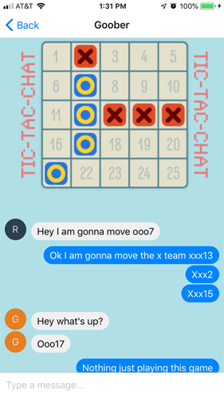

# REACT NATIVE Project

My loose ideas going into this week were to work with things I hadn't worked with during our React section. The areas I was thinking about delving into were game making, graphics, animation, sound manipulation, neural networks, and data exchange via users.

Early on I found a chat tutorial that involved using react native and the giftedchat library utilizing the firebase real-time database system that Ray had mentioned.
I settled on an idea of some sort of texting game/analyzer combo app. 

I was able to set anonymous user login and texting with data storage and a 5x5 tic-tac-toe game that can be played via texted instructions.
The tic-tac-toe game is really just a placeholder for a better type game but I wanted to get the basic implementation of multiple users interacting via text in an ongoing game that is updated and stored in local state. Very cool to see it on two devices with multiple anonymous users interacting!

## User Log-in:                
 

## Chat game screen:

 
My future vision for this app would be to have a few mini games and maybe some kind of text analyzers to choose from. The mini games would take simple commands as seen in the current tic-tac-toe game. Some games could involve drawing together or building something together. The text analyzer option would involve using the brain.JS neural network library to do comparisons of texts.  

Current Tech Stack:

React Native
Expo
react-native-gifted-chat
FireBase

